# ImageConventer Writeup

## 考点

`php C语言 源码审计` `反序列化` `条件竞争` `php文件路径处理` `md5碰撞`

## 难度

500

## 详细解题方法

### imagegd2函数

这个函数我们可以在

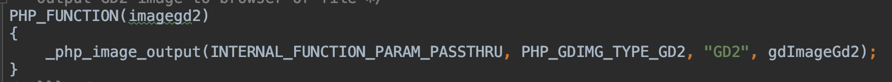

而`_php_image_output`会调用

```c
static void _php_image_output(INTERNAL_FUNCTION_PARAMETERS, int image_type, char *tn, void (*func_p)())
{
		// ...
		tmp = php_open_temporary_file(NULL, NULL, &path);
		// ...
}
```

意味着`php_open_temporary_file`函数会生成临时文件，而且由于

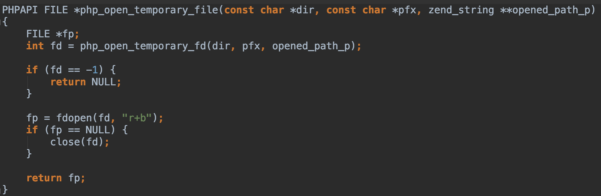

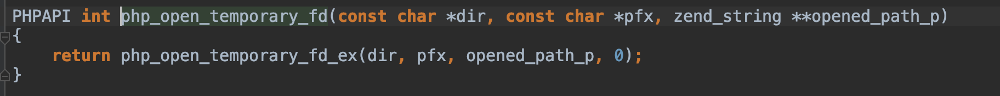

`php_open_temporary_fd_ex`的flag位为0，而且此处产生临时文件不受到`open_basedir`的制约(这个特性我也不知道有啥用

又由于`php_get_temporary_directory`的返回值受到`TMPDIR`的控制

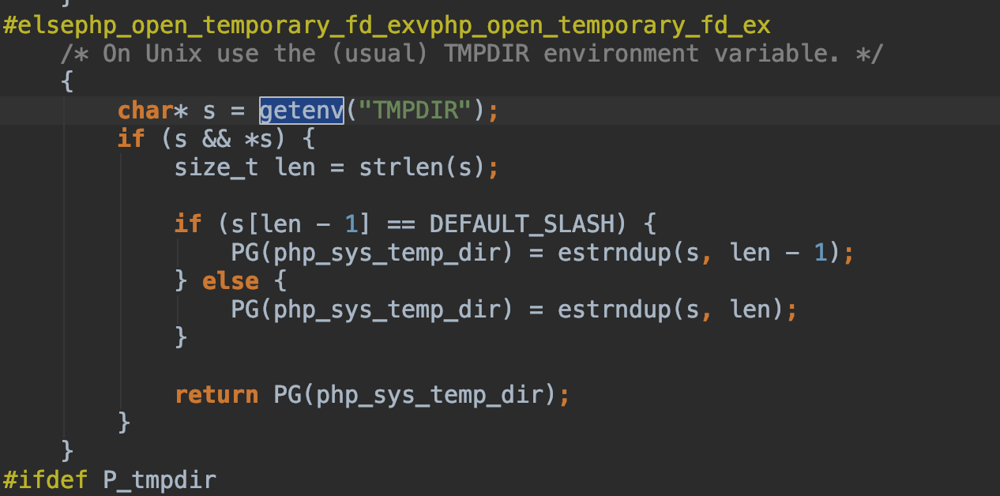

我们题目初设置的TMPDIR是控制其产生的目录，所以此处我们这个函数的目的即为产生临时文件

### GD2 File Format

我们在`https://libgd.github.io/manuals/2.2.4/files/gd_gd2-c.html`看到其文件格式

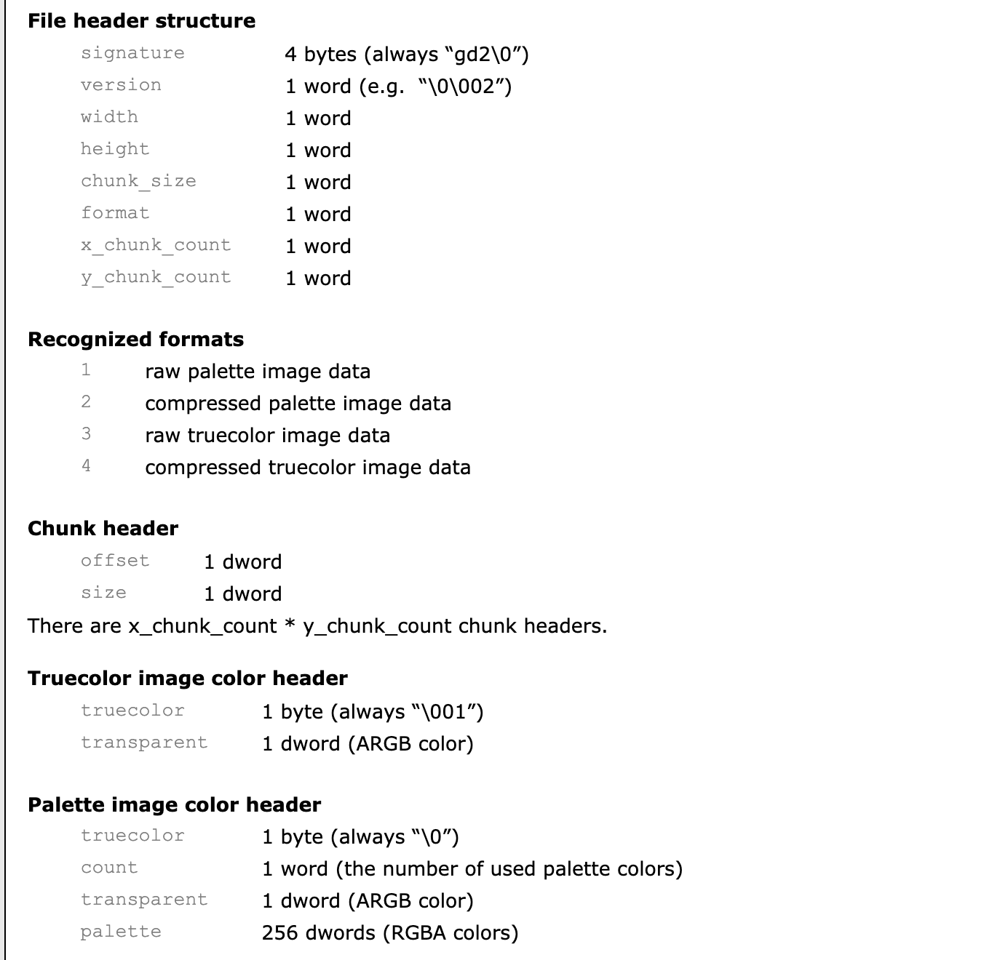

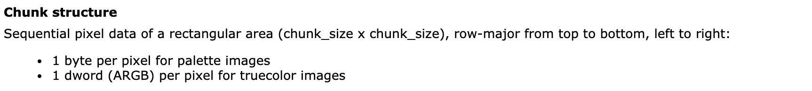

这是一个比较直观的文件格式，但是如果我们控制图片的`truecolor header`遍历255种颜色，我们则可以在输出得到包含所有字符集的GD2文件。

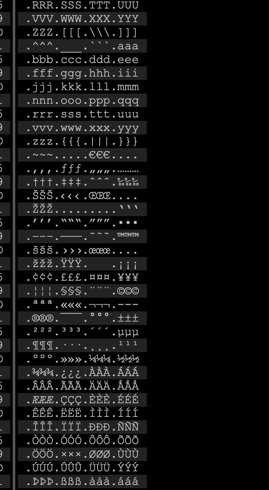

这就让我们可以得到一个构造机会，我们可以得到一个带有恶意代码的GD2文件。

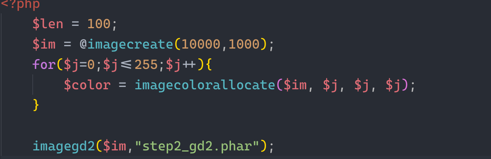

### 反序列化

我们则可以通过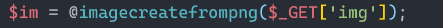

的可控变量`$_GET['img']`产生反序列化，但是如果需要GD2文件和Phar文件相互兼容，我们需要计算Phar的文件签名。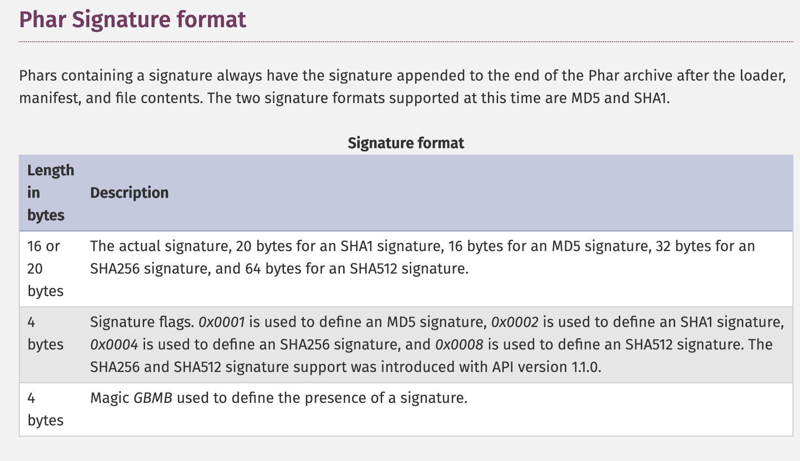

我们则可以产生一个可以满足反序列化要求的phar文件。

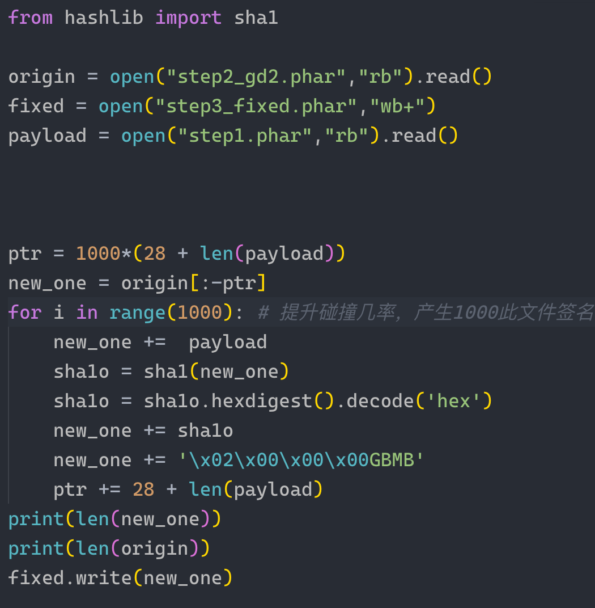

但是由于图片处理完毕之后即会被清除。我们需要构造一个较大的文件，用于解析，我们同时进行条件竞争。即可得到相应的反序列化。

之后就进入到反序列化中，

1. md5碰撞

​	在我们的给出的exp中，首先使用fastcoll生成两个相同前缀的md5相同的字符串

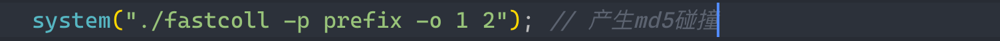

2. 绕过死亡之点

    

我们在文件最后加了一个`.`来干扰选手。我们可以参考`http://d1iv3.me/2018/04/15/%E4%BB%8EPHP%E6%BA%90%E7%A0%81%E7%9C%8BPHP%E6%96%87%E4%BB%B6%E6%93%8D%E4%BD%9C%E7%BC%BA%E9%99%B7%E4%B8%8E%E5%88%A9%E7%94%A8%E6%8A%80%E5%B7%A7/`的绕过方法进行绕过。

从而我们可以构造出

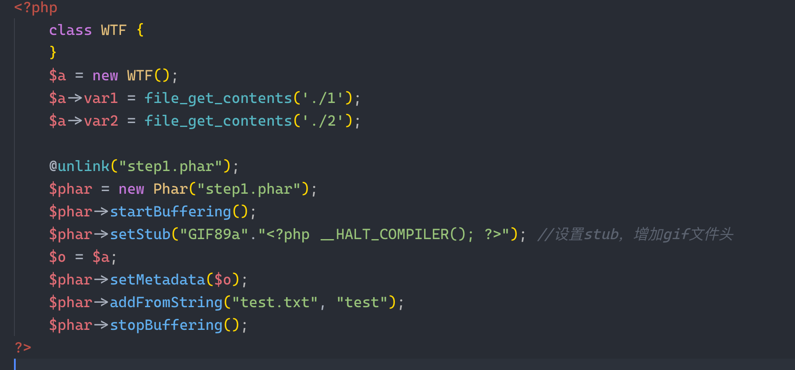

### 如何获得临时文件名

我们故意在sandbox中开启了Index，所以可以直接列目录获得文件名

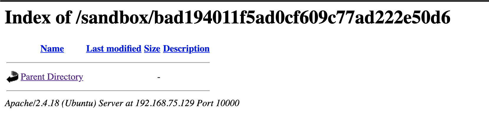

综上,利用过程如下

```
php gen.php // 产生final.png恶意图片
php -S 0.0.0.0 2333 // 启动图片服务器
打开Burp Intruder
```

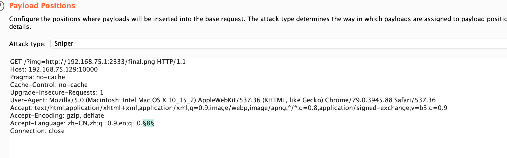

```
python exp.py
```

构造碰撞，相关代码见exploit目录